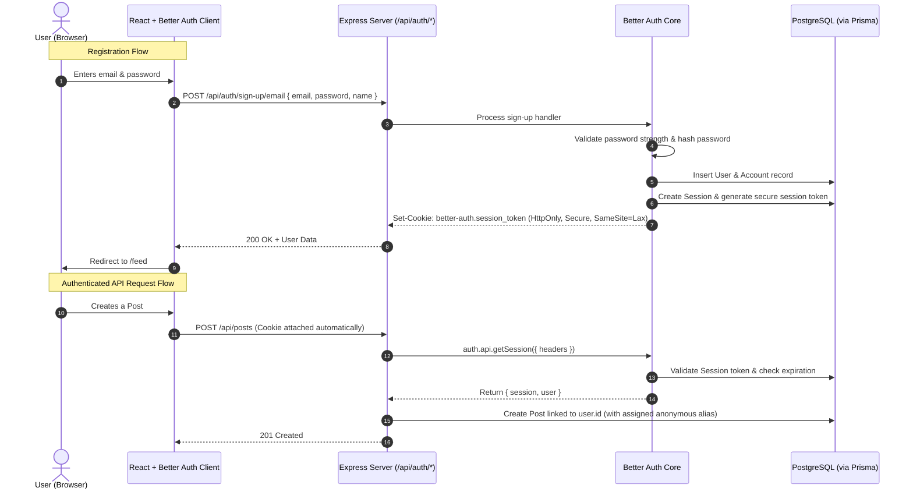

# Authentication Frontend Analysis & Better Auth Backend Design

## 1. Executive Summary

This document provides a thorough audit of the existing frontend authentication pages ([LoginPage.tsx](file:///c:/Users/Acer/Desktop/BEE_ANONIMY/client/src/pages/LoginPage.tsx) and [SignupPage.tsx](file:///c:/Users/Acer/Desktop/BEE_ANONIMY/client/src/pages/SignupPage.tsx)), evaluates their readiness and optimization for real-world authentication, and establishes the complete backend architecture for **Better Auth** in Anonimy (Node.js + Express + Prisma + PostgreSQL).

---

## 2. Frontend Analysis: [LoginPage.tsx](file:///c:/Users/Acer/Desktop/BEE_ANONIMY/client/src/pages/LoginPage.tsx) & [SignupPage.tsx](file:///c:/Users/Acer/Desktop/BEE_ANONIMY/client/src/pages/SignupPage.tsx)

### 2.1 Current Strengths (What is already well done)
1. **Design & Layout**:
   - High visual fidelity matching the Anonimy brand aesthetic: split-screen layout with botanical SVGs and warm organic shapes.
   - Smooth responsive behavior: collapses the left panel gracefully on mobile (`hidden md:flex`) and centers the form on right panel.
2. **Semantic Form & Input Attributes**:
   - Proper `type="email"` and `type="password"`.
   - Correct autofill attributes: `autoComplete="email"`, `autoComplete="current-password"`, and `autoComplete="new-password"`.
   - Proper `htmlFor` and `id` linking for form labels.
3. **Accessibility**:
   - Screen-reader labels (`aria-label`) on password visibility toggle buttons.
   - Decorative SVGs marked with `aria-hidden="true"`.
4. **Clean Component Architecture**:
   - Isolated state management with local `useState`.
   - `PasswordInput` helper component in `SignupPage.tsx` encapsulates show/hide password toggle logic cleanly.

---

### 2.2 Areas Requiring Optimization for Production Auth

While the presentation layer is clean, several vital authenticator concerns need to be added when connecting to the backend:

| Concern | Current State | Optimal Requirement |
| :--- | :--- | :--- |
| **Loading / Pending State** | No `isLoading` state. Form can be submitted repeatedly. | Submit button must show loading spinner / disable pointer events while network request is in flight to prevent duplicate requests. |
| **Error Feedback & UI Alert** | No error banner or inline field errors. | Display clear error messages (e.g., "Invalid email or password", "Email already registered", "Passwords do not match"). |
| **Client-Side Validation** | Basic HTML5 `required` + `noValidate` on form without custom validation logic. | In `SignupPage`, check if `password === confirm` and enforce minimum password length (e.g., >= 8 chars) before firing API call. |
| **Form Inputs Disabled During Submit** | Inputs remain editable while submitting. | Disable input fields (`disabled={isLoading}`) during auth request. |
| **Redirect Handling** | `handleSubmit` has a placeholder comment (`// Auth logic — Phase 2`). | After successful login/signup, navigate to `/feed` (or `redirect_url` if deep-linked). |
| **Better Auth Client Integration** | Missing Better Auth React client hooks (`authClient.signIn.email`, `authClient.signUp.email`). | Connect form handler to Better Auth client SDK. |
| **"Forgot password?" Link** | Currently points to `href="#"`. | Direct to password recovery flow or hide/disable until recovery endpoint is implemented. |

---

## 3. Better Auth Backend Architecture & Logic

### 3.1 Overview & Responsibilities
Anonimy utilizes **Better Auth** for secure credential management, password hashing (Argon2 / Scrypt), token/session lifecycle, and HTTP-only cookie issuance.



---

### 3.2 Database Schema Alignment (Prisma + Better Auth)

Better Auth requires four core tables in PostgreSQL. In Anonimy's Prisma schema, these map as follows:

```prisma
// ── Better Auth Core Models ───────────────────────────────────

model User {
  id            String    @id @default(uuid())
  email         String    @unique
  name          String?
  emailVerified Boolean   @default(false)
  image         String?
  createdAt     DateTime  @default(now())
  updatedAt     DateTime  @updatedAt

  // Better Auth Relations
  sessions      Session[]
  accounts      Account[]

  // Anonimy Domain Relations
  posts         Post[]
  comments      Comment[]
  participants  PostParticipant[]
  aliases       UserAlias[]

  @@map("user")
}

model Session {
  id        String   @id @default(uuid())
  userId    String
  user      User     @relation(fields: [userId], references: [id], onDelete: Cascade)
  token     String   @unique
  expiresAt DateTime
  ipAddress String?
  userAgent String?
  createdAt DateTime @default(now())
  updatedAt DateTime @updatedAt

  @@map("session")
}

model Account {
  id                    String    @id @default(uuid())
  userId                String
  user                  User      @relation(fields: [userId], references: [id], onDelete: Cascade)
  accountId             String
  providerId            String
  accessToken           String?
  refreshToken          String?
  accessTokenExpiresAt  DateTime?
  refreshTokenExpiresAt DateTime?
  scope                 String?
  password              String?
  createdAt             DateTime  @default(now())
  updatedAt             DateTime  @updatedAt

  @@map("account")
}

model Verification {
  id         String   @id @default(uuid())
  identifier String
  value      String
  expiresAt  DateTime
  createdAt  DateTime @default(now())
  updatedAt  DateTime @updatedAt

  @@map("verification")
}
```

---

### 3.3 Backend Express Integration Logic

#### 1. Better Auth Instance Initialization (`server/src/config/auth.ts`)
```typescript
import { betterAuth } from "better-auth";
import { prismaAdapter } from "better-auth/adapters/prisma";
import { prisma } from "./prisma";

export const auth = betterAuth({
  database: prismaAdapter(prisma, {
    provider: "postgresql",
  }),
  emailAndPassword: {
    enabled: true,
    requireEmailVerification: false, // For MVP; can be toggled to true later
    minPasswordLength: 8,
    maxPasswordLength: 64,
  },
  session: {
    expiresIn: 60 * 60 * 24 * 7, // 7 days
    updateAge: 60 * 60 * 24,      // 1 day
    cookieCache: {
      enabled: true,
      maxAge: 5 * 60,             // 5 minutes in memory cache
    },
  },
  advanced: {
    useSecureCookies: process.env.NODE_ENV === "production",
  },
  trustedOrigins: [
    process.env.CLIENT_URL || "http://localhost:5173",
  ],
});
```

#### 2. Express Route Handler Mounting (`server/src/app.ts`)
Better Auth provides a universal node handler to plug into Express routes seamlessly:
```typescript
import express from "express";
import cors from "cors";
import { toNodeHandler } from "better-auth/node";
import { auth } from "./config/auth";

const app = express();

app.use(cors({
  origin: process.env.CLIENT_URL || "http://localhost:5173",
  credentials: true, // Crucial for HttpOnly cookies
  methods: ["GET", "POST", "PUT", "DELETE", "OPTIONS"],
  allowedHeaders: ["Content-Type", "Authorization"],
}));

// Mount Better Auth endpoints at /api/auth/*
app.all("/api/auth/*", toNodeHandler(auth));

app.use(express.json());
```

#### 3. Authentication Middleware (`server/src/middleware/auth.middleware.ts`)
Protecting domain routes (`/api/posts`, `/api/comments`, etc.):
```typescript
import { Request, Response, NextFunction } from "express";
import { fromNodeHeaders } from "better-auth/node";
import { auth } from "../config/auth";

export interface AuthenticatedRequest extends Request {
  user?: {
    id: string;
    email: string;
    name?: string;
  };
  session?: {
    id: string;
    userId: string;
    expiresAt: Date;
  };
}

export async function requireAuth(req: AuthenticatedRequest, res: Response, next: NextFunction) {
  try {
    const session = await auth.api.getSession({
      headers: fromNodeHeaders(req.headers),
    });

    if (!session) {
      return res.status(401).json({ error: "Unauthorized: Active session required" });
    }

    req.user = session.user;
    req.session = session.session;
    next();
  } catch (error) {
    return res.status(500).json({ error: "Internal authentication error" });
  }
}
```

---

### 3.4 Anonimy Contextual Anonymity Bridge

One of the most critical requirements for Anonimy is maintaining privacy:
1. **Private Identity**: `User.id` and `User.email` are only stored in the backend and used for session verification.
2. **Contextual Identity**: When a user creates a post or comments on a thread:
   - The backend checks or allocates a `PostParticipant` entry linking `(postId, userId) -> aliasId`.
   - The public response serializes only the **Alias** (e.g., "Misty Willow", "Scarlet Fox") and an avatar color.
   - The user's real `userId` and `email` are **never** returned in post feeds or comment threads.

---

## 4. Frontend Integration Plan (When Ready)

1. **Better Auth React Client**:
   Create `client/src/lib/auth-client.ts`:
   ```typescript
   import { createAuthClient } from "better-auth/react";

   export const authClient = createAuthClient({
     baseURL: import.meta.env.VITE_API_URL || "http://localhost:5000",
   });
   ```
2. **Connecting `LoginPage.tsx`**:
   - `authClient.signIn.email({ email, password })`
   - Handle loading state and errors.
3. **Connecting `SignupPage.tsx`**:
   - Validate `password === confirm`
   - `authClient.signUp.email({ email, password, name: email.split('@')[0] })`
   - Handle errors (e.g., `EMAIL_ALREADY_IN_USE`).
4. **Real Session in `App.tsx`**:
   - Replace `IS_MOCK_AUTHENTICATED` with `const { data: session, isPending } = authClient.useSession()`.

---

## 5. Next Steps
- Review and approve the proposed backend authentication architecture.
- Proceed with backend database migration and Express server setup upon confirmation.
