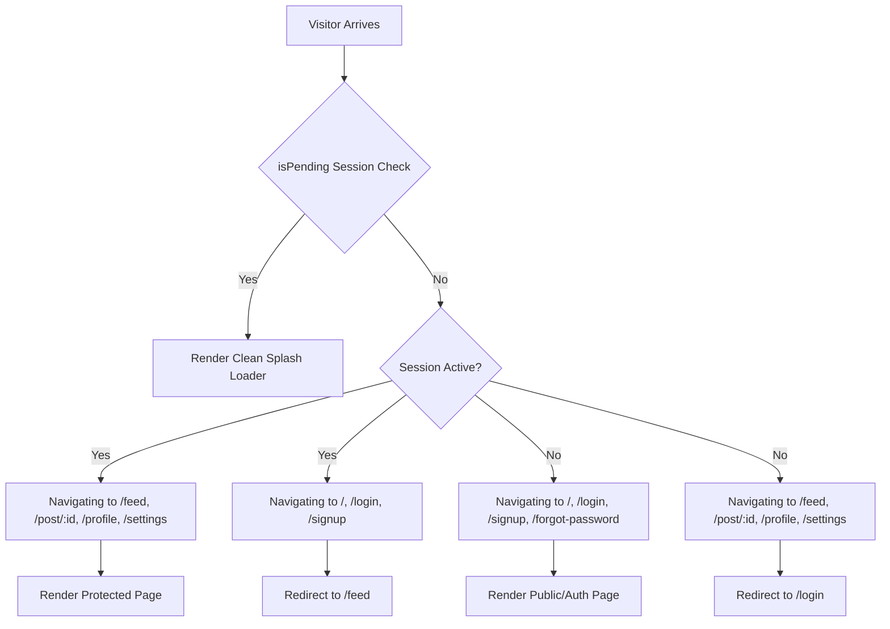

# Anonimy — Frontend Auth Flow Integration Review

> **Date:** September 28, 2026  
> **Scope:** Full Frontend Authentication Flow, Route Guards, Session State, and Email OTP Integration (`client/src/pages/LoginPage.tsx`, `client/src/pages/SignupPage.tsx`, `client/src/pages/ForgotPasswordPage.tsx`, `client/src/App.tsx`, `client/src/lib/auth-client.ts`, `client/src/lib/email-validator.ts`)  
> **Status:** ✅ **COMPLETED & VERIFIED**

---

## 1. Executive Summary

All High Priority tasks associated with **Frontend Auth Flow Integration** have been fully implemented, integrated, and verified against the backend Better Auth and PostgreSQL persistence layer.

The authentication experience in Anonimy now provides:
1. **LoginPage (`/login`):** Live form validation via [`email-validator.ts`](file:///c:/Users/Acer/Desktop/BEE_ANONIMY/client/src/lib/email-validator.ts), direct integration with `authClient.signIn.email()`, Google OAuth sign-in trigger, inline error banners, disabled/loading states to prevent double submissions, and auto-redirect to `/feed`.
2. **SignupPage (`/signup`):** Smooth 2-step registration experience:
   - **Step 1 (Form):** Validates email format, rejects disposable email domains, enforces password matching and minimum 8-character complexity, then calls `authClient.signUp.email()`.
   - **Step 2 (OTP Verification):** Automatically renders a 6-digit segmented OTP input with full keyboard navigation (left/right arrows, backspace across boxes, paste handling) wired to `authClient.emailOtp.verifyEmail()`, followed by session activation and immediate redirect to `/feed`. Includes a 60-second cooldown timer for resending OTPs and a "Back to edit details" action.
3. **ForgotPasswordPage (`/forgot-password`):** Complete 3-step password recovery workflow (`Request OTP` → `Verify OTP` → `Submit New Password`) communicating with the server's rate-limited reset endpoints.
4. **App-level Route Guards (`App.tsx`):** Protected routes (`/feed`, `/post/:postId`, `/profile`, `/settings`) redirect unauthenticated visitors to `/login`. Guest/auth routes (`/`, `/login`, `/signup`) redirect authenticated users directly to `/feed`. An initial session loader prevents flashes of incorrect page state.
5. **Session-driven Profiles & Sign-out (`ProfilePage.tsx`, `SettingsPage.tsx`):** Renders authenticated user details (`email`, formatted `memberSince`) and provides instantaneous sign-out via `signOut()`.

---

## 2. Component-by-Component Review

### 2.1. LoginPage (`client/src/pages/LoginPage.tsx`)

| Feature / Requirement | Implementation | Status |
| :--- | :--- | :--- |
| **Email Validation** | Validates syntax and rejects burner domains before sending requests using `validateEmail()` | ✅ Verified |
| **Better Auth Integration** | Calls `authClient.signIn.email({ email, password })` with normalized lowercase email | ✅ Verified |
| **Google OAuth Integration** | Triggered via `authClient.signIn.social({ provider: 'google', callbackURL })` | ✅ Verified |
| **Error Handling** | Displays contextual red alert banner with server-returned error messages (bad credentials, unverified account, rate limits) | ✅ Verified |
| **Double-Submit Prevention** | Disables inputs and buttons during `isLoading` / `isGoogleLoading` with interactive spinner text | ✅ Verified |
| **Autofill Collision Shield** | Hidden honeypot inputs prevent aggressive browser password autofill collisions | ✅ Verified |
| **Navigation** | Redirects to `/feed` on successful authentication; links to `/forgot-password`, `/signup`, and `/` | ✅ Verified |

```tsx
// LoginPage.tsx — submission logic
const handleSubmit = async (e: React.FormEvent) => {
  e.preventDefault();
  if (!email || !password) {
    setErrorMessage('Please fill in all fields');
    return;
  }

  const emailValidation = validateEmail(email);
  if (!emailValidation.isValid) {
    setErrorMessage(emailValidation.error || 'Please enter a valid email address');
    return;
  }

  setIsLoading(true);
  setErrorMessage('');

  try {
    const { error } = await authClient.signIn.email({
      email: emailValidation.normalizedEmail || email.trim(),
      password,
    });

    if (error) {
      setErrorMessage(error.message || 'Invalid email or password');
      setIsLoading(false);
      return;
    }

    navigate('/feed');
  } catch {
    setErrorMessage('An unexpected error occurred. Please try again.');
    setIsLoading(false);
  }
};
```

---

### 2.2. SignupPage (`client/src/pages/SignupPage.tsx`)

| Feature / Requirement | Implementation | Status |
| :--- | :--- | :--- |
| **Step 1: Form Validation** | Enforces non-disposable email, password confirmation match, and minimum length >= 8 characters | ✅ Verified |
| **Step 1: Sign-up Trigger** | Dispatches `authClient.signUp.email({ email, password, name })`, triggering backend OTP generation | ✅ Verified |
| **Step 2: Transition** | Seamless transition to OTP input screen with success banner and 60s cooldown timer | ✅ Verified |
| **Segmented OTP Input** | 6 individual digit inputs with paste support, auto-advance, backspace auto-retreat, and arrow key navigation | ✅ Verified |
| **OTP Verification & Session** | Verifies code via `authClient.emailOtp.verifyEmail({ email, otp })` and establishes session | ✅ Verified |
| **Resend OTP** | Calls `authClient.emailOtp.sendVerificationOtp({ email, type: 'email-verification' })` with cooldown lock | ✅ Verified |
| **Back Navigation** | Allows user to return to Step 1 to edit their email without resetting entire page state | ✅ Verified |

```tsx
// SignupPage.tsx — OTP verification & session establishment
const handleVerifyOtp = async (e: React.FormEvent) => {
  e.preventDefault();
  if (otp.length < 6) {
    setErrorMessage('Please enter the complete 6-digit verification code');
    return;
  }

  setIsLoading(true);
  setErrorMessage('');

  try {
    const normalizedEmail = email.trim().toLowerCase();
    const { error } = await authClient.emailOtp.verifyEmail({
      email: normalizedEmail,
      otp: otp.trim(),
    });

    if (error) {
      setErrorMessage(error.message || 'Invalid or expired verification code');
      setIsLoading(false);
      return;
    }

    // Ensure session cookie is set
    if (password) {
      await authClient.signIn.email({
        email: normalizedEmail,
        password,
      }).catch(() => null);
    }

    setSuccessMessage('Email verified successfully! Redirecting to feed...');
    setTimeout(() => {
      navigate('/feed', { replace: true });
    }, 500);
  } catch {
    setErrorMessage('Verification failed. Please check the code and try again.');
    setIsLoading(false);
  }
};
```

---

### 2.3. Route Guards & App Lifecycle (`client/src/App.tsx`)

The application enforces declarative route access control based on `useSession()` from Better Auth:



---

## 3. Verification & Build Results

### 3.1. Client Production Build
- **Command:** `npm run build` (`tsc -b && vite build`)
- **Result:** `✓ 1906 modules transformed.`
- **Bundle output:**
  - `dist/index.html`: `0.92 kB` (gzip: `0.50 kB`)
  - `dist/assets/index.css`: `31.23 kB` (gzip: `6.83 kB`)
  - `dist/assets/index.js`: `425.57 kB` (gzip: `118.18 kB`)
- **Exit Code:** `0` (0 errors, 0 warnings)

### 3.2. Server Typecheck
- **Command:** `npx tsc --noEmit`
- **Result:** 0 TypeScript diagnostic errors.
- **Exit Code:** `0`

---

## 4. Definition of Done Checklist

- [x] `LoginPage.tsx` fully wired to `authClient.signIn.email()` and `signIn.social({ provider: 'google' })`
- [x] `SignupPage.tsx` fully wired to `authClient.signUp.email()` with 2-step OTP flow (`authClient.emailOtp.verifyEmail()`)
- [x] Interactive 6-digit segmented OTP input with paste and keyboard navigation
- [x] 60-second cooldown timer for OTP resend
- [x] Client-side syntax and disposable email filtering via `validateEmail()`
- [x] Full error banner reporting for all failure modes
- [x] Route guards protecting private routes and auto-redirecting authenticated sessions
- [x] Clean sign-out in `ProfilePage.tsx` and `SettingsPage.tsx`
- [x] Codebase audit updated to reflect 100% completion of High Priority tasks
