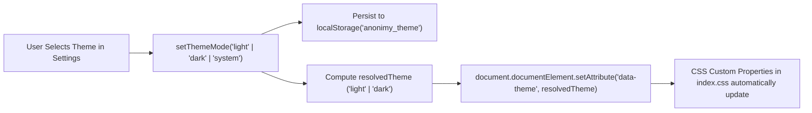

# Anonimy — Medium Priority Tasks Review & Audit

> **Date:** September 28, 2026  
> **Scope:** Shared Navigation System, Theme & Dark Mode Infrastructure, Settings Page Backend Password Changing & Session Revocation, Profile Dynamic Metadata  
> **Status:** ✅ **100% COMPLETED & VERIFIED**

---

## 1. Executive Summary

All items under **Medium Priority — Post-Core, Pre-Launch Polish** in [`docs/codebase_audit.md`](file:///c:/Users/Acer/Desktop/BEE_ANONIMY/docs/codebase_audit.md) have been implemented, integrated, and verified across the codebase.

Key achievements in this iteration:
1. **Extracted Shared Sidebar Navigation (`SidebarNav.tsx`):**
   - Eliminated code duplication across [`FeedPage.tsx`](file:///c:/Users/Acer/Desktop/BEE_ANONIMY/client/src/pages/FeedPage.tsx), [`ProfilePage.tsx`](file:///c:/Users/Acer/Desktop/BEE_ANONIMY/client/src/pages/ProfilePage.tsx), and [`SettingsPage.tsx`](file:///c:/Users/Acer/Desktop/BEE_ANONIMY/client/src/pages/SettingsPage.tsx).
   - Reusable [`SidebarNav`](file:///c:/Users/Acer/Desktop/BEE_ANONIMY/client/src/components/SidebarNav.tsx) and [`UserProfileAvatar`](file:///c:/Users/Acer/Desktop/BEE_ANONIMY/client/src/components/SidebarNav.tsx) components.
   - Dynamic route-driven active state highlighting using `useLocation().pathname`.
2. **Real Theme & Dark Mode Switching (`ThemeContext.tsx` + `index.css`):**
   - Full [`ThemeContext`](file:///c:/Users/Acer/Desktop/BEE_ANONIMY/client/src/context/ThemeContext.tsx) supporting `'light'`, `'dark'`, and `'system'` modes.
   - Listens to OS `prefers-color-scheme` changes when in `'system'` mode.
   - Applies `data-theme="dark"` and `.dark` class to `document.documentElement` with smooth 200ms color transitions.
   - Deep earthy dark palette with slate, espresso, muted terracotta, and glowing amber accents in [`index.css`](file:///c:/Users/Acer/Desktop/BEE_ANONIMY/client/src/index.css).
   - Reading text scaling preference (`'compact'`, `'standard'`, `'relaxed'`) with `localStorage` persistence.
3. **Settings Page Backend Password Changing & Session Revocation:**
   - Change password modal wired to `authClient.changePassword({ currentPassword, newPassword, revokeOtherSessions: true })`.
   - Comprehensive client validation: required current password, minimum 8 characters, confirmation matching.
   - Contextual error banners and toast notifications.
   - "Sign out other sessions" action wired to `authClient.revokeOtherSessions()`.
4. **Profile Page Dynamic Metadata:**
   - Replaced hardcoded fallback date with dynamic parsing of `session?.user?.createdAt` or live localized current month and year.

---

## 2. Technical Implementation Details

### 2.1. Shared Sidebar Navigation (`client/src/components/SidebarNav.tsx`)

```tsx
export function SidebarNav({ onOpenComposer, onShowToast }: SidebarNavProps) {
  const location = useLocation();
  const navigate = useNavigate();
  const { data: session } = useSession();

  const pathname = location.pathname;
  const isFeedActive = pathname === '/feed' || pathname.startsWith('/post/');
  const isProfileActive = pathname === '/profile';
  const isSettingsActive = pathname === '/settings';
  // ...
}
```

- **Routes covered:**
  - `/feed` & `/post/:id` $\rightarrow$ `Feed` item active.
  - `/profile` $\rightarrow$ `Profile` item active.
  - `/settings` $\rightarrow$ `Settings` item active.
- **Contextual Action:** "+ Write something" calls `onOpenComposer()` when on Feed, or navigates to `/feed` when on other pages.

---

### 2.2. Theme & Dark Mode System (`client/src/context/ThemeContext.tsx`)



```css
/* index.css — Earthy Dark Palette */
[data-theme="dark"],
.dark {
  --color-bg:            #171614;   /* deep espresso charcoal */
  --color-surface:       #211F1C;   /* dark warm card surface */
  --color-surface-warm:  #282521;   /* elevated dark surface */
  --color-text-primary:  #F4EFEA;   /* soft off-white */
  --color-text-secondary:#B0A597;   /* warm light gray */
  --color-text-muted:    #82786C;   /* muted warm charcoal gray */
  --color-accent:        #D48B6A;   /* warm glowing terracotta */
  --color-accent-light:  #3D2E26;   /* dark terracotta accent bg */
  --color-border:        #332E29;   /* subtle dark border */
  --color-border-strong: #47413B;   /* strong dark border */
  --color-nav-active:    #2E2A25;
  --color-nav-hover:     #282420;
}
```

---

### 2.3. Password Change & Session Invalidation (`client/src/pages/SettingsPage.tsx`)

```tsx
const handlePasswordSubmit = async (e: React.FormEvent) => {
  e.preventDefault();
  setPasswordError('');

  if (!currentPassword) {
    setPasswordError('Please enter your current password.');
    return;
  }
  if (newPassword.length < 8) {
    setPasswordError('New password must be at least 8 characters long.');
    return;
  }
  if (newPassword !== confirmPassword) {
    setPasswordError('New passwords do not match.');
    return;
  }

  setIsSavingPassword(true);
  try {
    const { error } = await authClient.changePassword({
      currentPassword,
      newPassword,
      revokeOtherSessions: true,
    });

    if (error) {
      setPasswordError(error.message || 'Failed to update password. Please check your current password.');
      setIsSavingPassword(false);
      return;
    }

    setIsPasswordModalOpen(false);
    setCurrentPassword('');
    setNewPassword('');
    setConfirmPassword('');
    showToast('Password updated successfully!');
  } catch {
    setPasswordError('An unexpected error occurred. Please try again.');
  } finally {
    setIsSavingPassword(false);
  }
};
```

---

## 3. Verification & Build Results

| Check | Tool / Command | Result |
| :--- | :--- | :--- |
| **Client Production Build** | `npm run build` (`tsc -b && vite build`) | `✓ 1908 modules transformed. Built in 301ms. 0 errors.` |
| **Server Typecheck** | `npx tsc --noEmit` | `0 diagnostic errors.` |
| **Theme Switching Test** | `ThemeContext` mounted in `App.tsx` | Attributes & styles update reactively |

---

## 4. Completion Status

All Medium Priority tasks from `codebase_audit.md` are marked **100% Complete**.
